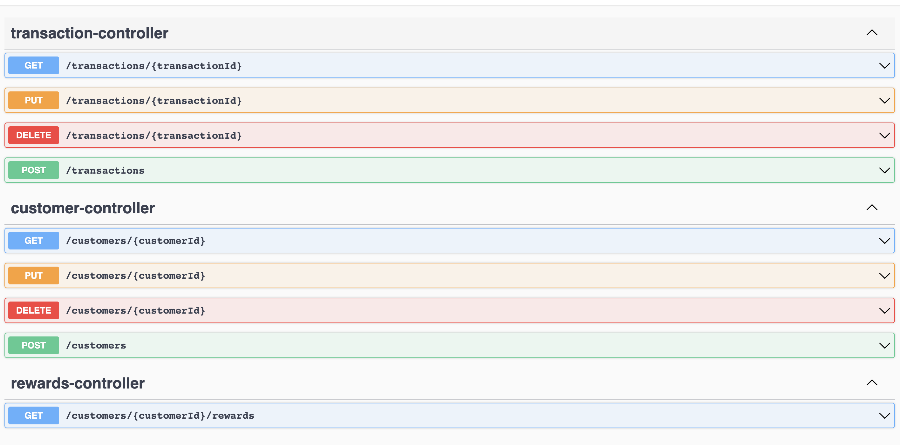

## CUSTOMER REWARDS SERVICE

### Problem Description

A retailer offers a rewards program to its customers, awarding points based on each recorded purchase.

A customer receives 2 points for every dollar spent over $100 in each transaction, plus 1 point for every dollar spent between $50 and $100 in each transaction.

(e.g. a $120 purchase = 2x$20 + 1x$50 = 90 points).

Given a record of every transaction during a three-month period, calculate the reward points earned for each customer per month and total.

### Endpoints Description

#### Customer Controller

1. SaveCustomer ("/customers")
   Allows users to create a new customer and able to store in the database.
2. GetCustomer ("/customers/{customerId}")
   Allows users to retrieve a specific customer from the database by providing the customer ID to the request. 
3. DeleteCustomer ("/customers/{customerId}")
   Allows users to delete a specific customer from the database by providing the customer ID to the request.
4. UpdateCustomer ("/customers/{customerId}")
   Allows users to update a specific customer from the database by providing the customer ID to the request.

#### Transaction Controller

1. SaveTransaction ("/transactions")
   Allows users to create a new transaction for a provided customer and throws exception if customer does not exist.
2. GetTransaction ("/transactions/{transactionId}")
   Can query to get transaction if provided transaction id to the request.
3. DeleteTransaction ("/transactions/{transactionId}")
   Able to delete a transaction from database by providing specific transaction id to the request.
4. UpdateTransaction ("/transactions/{transactionId}")
   allows users to update a specific transaction resource in the database by providing the transaction ID as a path parameter.

#### Rewards Controller

GetRewardsForCustomer ("/customers/{customerId}/rewards")

Using this endpoint users can query for total rewards earned by the customer, can query for the total rewards earned in a month and also in a year.
The rewards information for the specified customer for the specified month and year. When month and year are not provided, total rewards of customer is returned. When month is provided and year is not provided, rewards for month of current year is returned. When month is not provided and year is provided, total rewards of customer for that year is returned.

### Technologies used

• Spring boot

• Java 17

• H2 database

• Maven

• Swagger OpenAPI3

• SLF4J logging

• Spring HATEOAS

• Spring AOP

• Spring JPA

• Junit5

### Database Connectivity

1. http://localhost:8080/h2-console
2. JDBC URL:jdbc:h2:mem:retailDB
3. username : sa
4. password :

### Swagger Output

